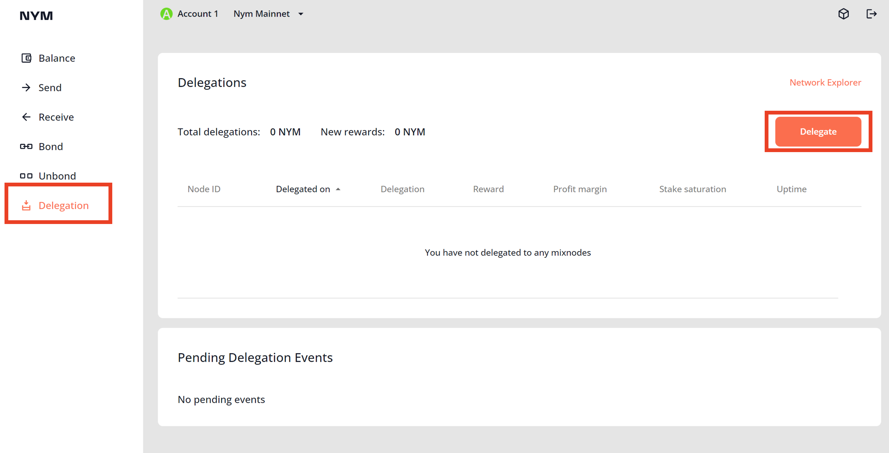

# 新手101 - NYM 跨链与质押

[TOC]

相信很多新接触NYM的小伙伴在好奇怎么才能参与NYM的质押，本篇教程就来讲一讲吧。

目前绝大多数交易所中的NYM代币是在以太坊上的ERC20代币，想参与质押，就需要将以太坊上的ERC20代币跨链跨到NYM 主网上。因此本篇教程包含两部分：1) 把代币从以太坊网络跨到NYM主网 2） 在NYM主网上参与质押。

##  把NYM代币以太坊跨到NYM主网

tl;dr

- 准备 metamask钱包，keplr钱包，NYM wallet
- 使用`https://spacestation.zone/` 将NYM从**以太坊跨到 Gravty Bridge**，再次使用`https://spacestation.zone/` 将NYM从 **Gravty Bridge跨到NYM主网**
- 将 keplr助记词导入到 NYM wallet中


下面是具体操作：

### 准备钱包

 
 首先确保你有一个metamask钱包，并且在以太坊上有一定手续费（0.05 ETH足够）。同时确保你有一个 Keplr钱包，还有一个 最新版本的NYM wallet。
 
 > NYM团队最近发布了 1.0.5 版本的 NYM wallet，你可以在[https://nymtech.net/download/](https://nymtech.net/download/)下载  
 > 如果你没有的metamask 、keplr的话，在[谷歌扩展商店](https://chrome.google.com/webstore/category/extensions)分别搜索下载 [metamask](https://chrome.google.com/webstore/detail/metamask/nkbihfbeogaeaoehlefnkodbefgpgknn)以及[keplr](https://chrome.google.com/webstore/detail/keplr/dmkamcknogkgcdfhhbddcghachkejeap)。并在下载好之后按照指示创建好钱包地址。 
 

 准备好手钱包之后，将NYM ERC20 token添加到metamask的token列表中。点击 metamask中的导入代币 -》 自定义代币，并在 代币合约地址 中输入 `0x525A8F6F3Ba4752868cde25164382BfbaE3990e1`。这个时候点击添加自定义代币 -》 导入 代币，即可在钱包中看到 NYM代币。
 

 
 > 如果你看到自己的NYM余额是 0，请记得从交易所或者coinlist中把NYM代币提现
 
 
 

###  将NYM 从 以太坊转至 NYM主网
 
准备好钱包之后便可以将 NYM代币从以太坊转至 NYM主网，这个操作需要跨两次链，路径为： `以太坊 --> Gravty Bridge --> Nym 主网` ，这两次跨链可以在 [spacestation.zone](https://spacestation.zone/) 这个桥上实现。

操作如下：

#### 以太坊--> Gravty Bridge 
打开  [spacestation.zone](https://spacestation.zone/) ，将Source 选为 Ethereum，Destination选为 Gravty Bridge 。点击 左右两个connect 连接钱包。 点击Select token ，选择 Nym。输入想要跨链的数量，并点击 Transfer。  
之后会依次跳出**两个**请求签名的弹框，在确认之后稍等片刻（大约需要5分钟），便可以成功将Nym 从 以太坊 转移到 Gravty Bridge。
 

#### Gravty Bridge --> Nym 主网
在 [spacestation.zone](https://spacestation.zone/) 页面上，将Source 选为  Gravty Bridge，Destination选为Nyx（Nyx 即Nym 主网） ， 并点击 Nyx下的 connet。第一次跨链会出现两个需要授权的弹窗，点击Approve即可。
在Apprive之后，选择Nym token，输入要跨链的金额，并点击Transfer 即可。稍等片刻（大约1分钟），便可以将Nym从Gravty Bridge 跨到 Nym 主网。

####  查看Nym代币的余额
完成跨链之后可以在区块浏览器上查看自己钱包的余额。
- 打开Keplr钱包，选择NYX网络，并复制地址（单击地址即可复制）
-  打开[https://mixnet.explorers.guru/](https://mixnet.explorers.guru/)，并在搜索栏输入刚刚的地址（格式为`n...`)，即可查看自己的余额。

### 将 keplr助记词导入到 NYM wallet中

***请注意助记词关乎账户安全，千万不要透露给任何人！以下操作推荐在断网条件下进行，并在结束之后清空剪贴板***  
首先需要导出keplr钱包的助记词。在Keplr钱包中，点击账户按钮，然后左侧的三个点，并点击 View Nmomonic Seed，在输入钱包钱包密码后就可以看到 助记词，复制这些助记词。

打开Nym wallet，点击 Sige in --> Sign in with mnomen，将刚才的 助记词复制进来，即可将助记词导入。在钱包页面也能看到Nym余额

至此，我们完成跨链。

## 质押Nym代币

tl;dr  

- 在[https://explorer.nymtech.net/network-components/mixnodes/](https://explorer.nymtech.net/network-components/mixnodes/) 挑选想要质押的节点，并复制Identity Key
- 在Nym wallet 中 质押
- 需要时候在Nym wallet中解质押

### 挑选节点
质押Nym前选择合适的节点来质押。  
打开[https://explorer.nymtech.net/network-components/mixnodes/](https://explorer.nymtech.net/network-components/mixnodes/) 挑选想要质押的节点。请注意挑选节点时候，Stake Saturation 超过100%的节点**不会产生收益**，请避开这些节点。挑好节点后，复制节点的 Identity Key

### 向节点质押
打开Nym wallet ，（在[这里下载](https://nymtech.net/download/)），并点击 Delegation。粘贴 Identity Key，指定数量（请留下0.1-0.5个Nym做手续费，不要全部质押），并点击 Delegate Stake。稍等片刻便可以完成质押。在pending events中可以看到自己的质押，在*过一段时间*（一个epoch，最多两个小时）之后，质押金额可产生收益。

###  取消质押
有时候节点Stake Saturation，需要解除质押。解除时候在Delegations中选择想要解除的质押，点击三个点，并点击  Undelegate，即可解除质押。

